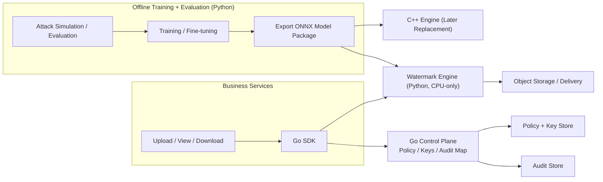

# Architecture

## Key Flows

1. Merchant upload
- SDK calls control plane for policy/trace payload.
- SDK calls engine to embed robust + fragile watermark.

1. Internal view
- SDK requests a per-request policy and payload.
- SDK calls engine to embed robust + light visible watermark.

1. Internal download
- SDK requests a per-request policy and payload.
- SDK calls engine to embed robust + strong visible watermark.

## Engine Replacement Path

- Model format: ONNX.
- Protocol remains stable via `engine/proto/*`.
- Python engine runs first; C++ engine can replace it later.
